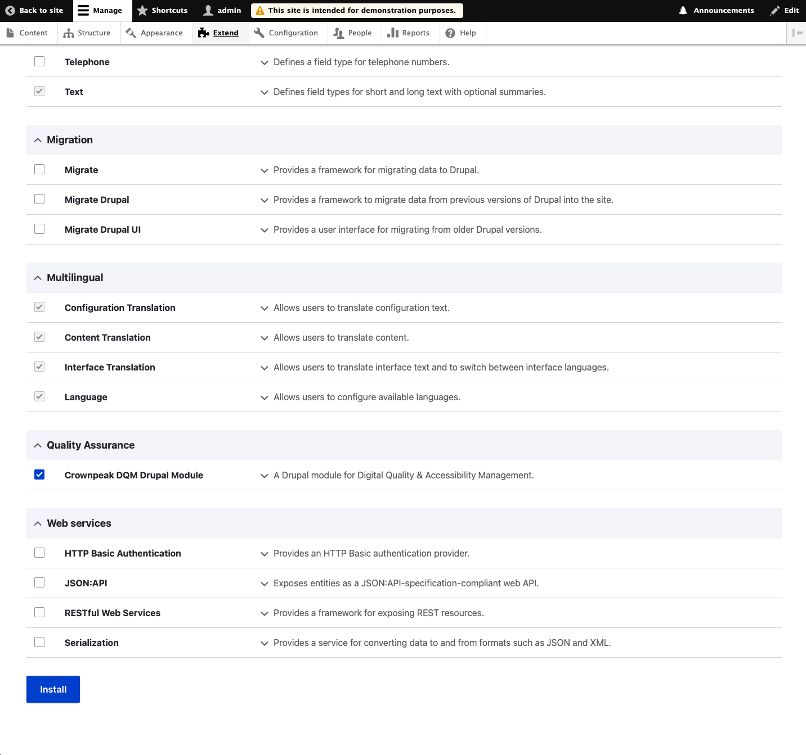
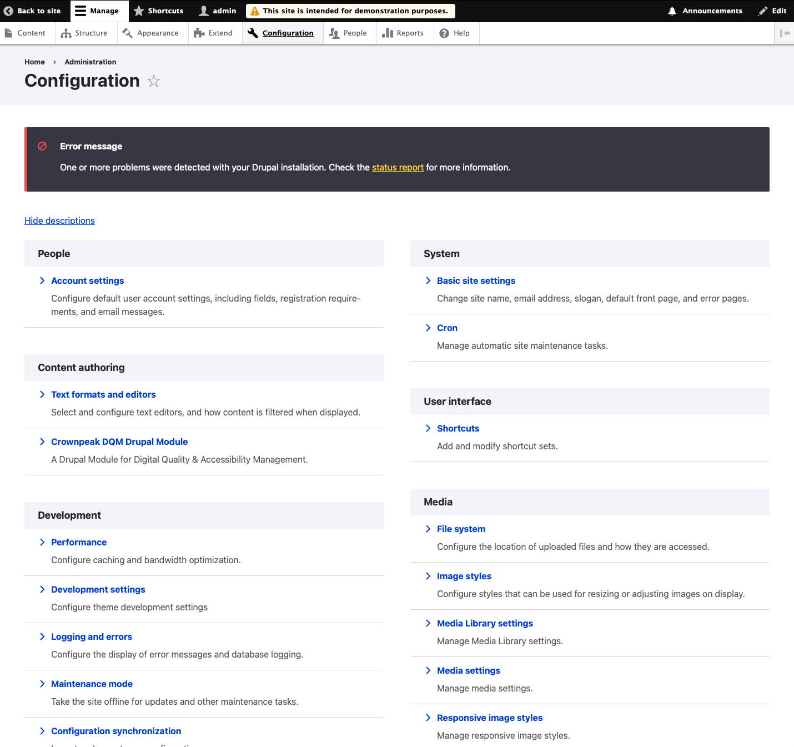
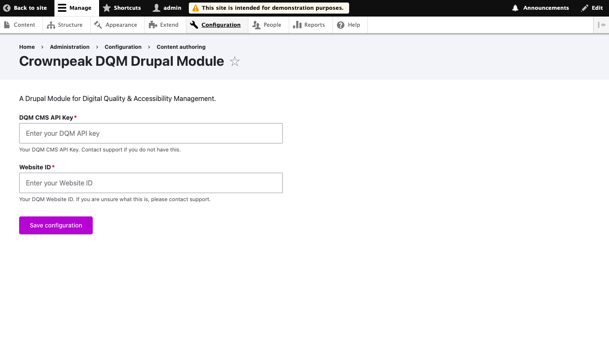
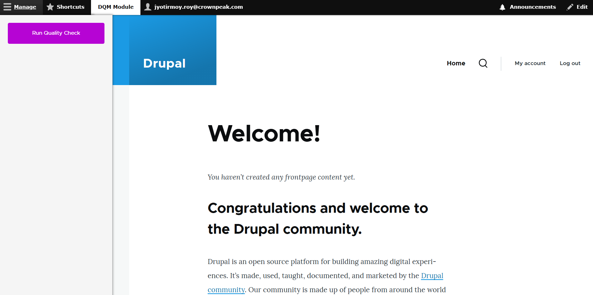
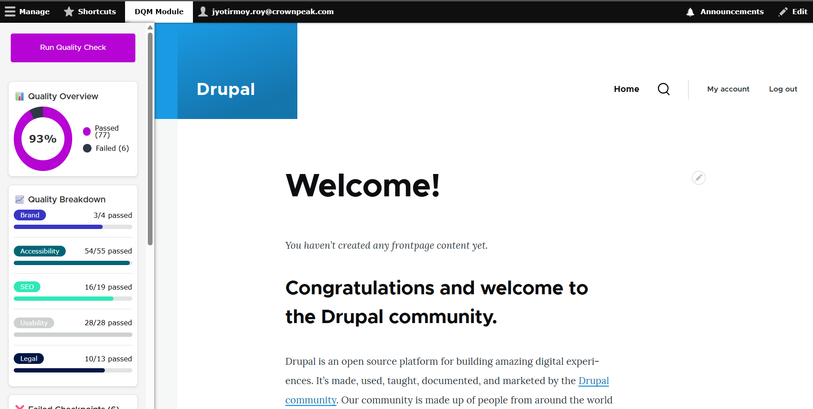

<a href="http://www.crownpeak.com" target="_blank"></a>

# Crownpeak DQM Drupal Module
This module integrates [Crownpeak DQM](https://www.crownpeak.com/firstspirit/products/digital-accessibility/digital-accessibility-and-quality-management-dqm/) into the Drupal admin experience, allowing you to see quality, accessibility, and SEO issues directly from the content authoring interface.

---

## 🚀 Features

- Quality and accessibility insights for content editors
- Page-level scanning with DQM checkpoint results
- Integration with the Drupal admin toolbar
- Customizable DQM project and settings
- Works with any Drupal content type

---

## 📦 Installation

### Option 1: Manual Upload (Recommended for Site Builders)

1. **Download the module ZIP**
    - From your implementation team or package build.

2. **Place in your Drupal project**
    ```bash
    cp dqm_drupal_module.zip web/modules/
    cd web/modules
    unzip dqm_drupal_module.zip
    rm dqm_drupal_module.zip
    ```

3. **Enable the module**
    - Go to `/admin/modules` and enable **Crownpeak DQM Drupal Module**
    - Or use Drush:
      ```bash
      drush en dqm_drupal_module -y
      ```
---

## ⚙️ Configuration

1. Go to:  
   `/admin/config/content/dqm-drupal-module`

2. Enter your Crownpeak DQM configuration:
    - **DQM CMS API Key**
    - **Website IDy**

3. Save configuration.

---

## 🧩 Usage

After installation and configuration:

- A new "DQM Module" tray will appear in the **admin toolbar** when managing a content page
- Content editors can scan any page using the Crownpeak DQM service
- Issues will be displayed inline for accessibility and quality review

---

## 📸 Screenshots
1. Drupal "Extend" screen showing Crownpeak DQM Module
   

2. Drupal "Configure" screen showing enabled module
   

3. Drupal "Configure" screen showing DQM credential entry
   

4. DQM Module running when managing a content page
   

5. DQM Module showing quality check results
   

---

## 🛠 Development

This module is open for extension and theming.

Key locations:

- Forms: `src/Form/SettingsForm.php`
- Scanning logic: `src/Controller/ScanController.php`
- Toolbar integration: `src/Controller/ToolbarTrayController.php`
- Assets: `/js/`, `/css/`, `/images/`

---

## 🙋‍♀️ Support

If you need help with installation or integration, contact your Crownpeak implementation team or visit [Crownpeak Support](https://www.crownpeak.com/support).

---

##  Legal Notices
[Repository Title] is an example solution subject to the [MIT license](./LICENSE).

This data connector must not be used for any illegal activities or in ways that could harm Crownpeak or Fredhopper's systems.

Copyright © 2025 Crownpeak Technology, Inc. All rights reserved. Fredhopper is a trademark of Crownpeak Technology, Inc.

---

## Disclaimer
This document is provided for information purposes only. Crownpeak may change the contents hereof without notice. This document is not warranted to be error-free, nor subject to any other warranties or conditions, whether expressed orally or implied in law, including implied warranties and conditions of merchantability or fitness for a particular purpose. Crownpeak specifically disclaims any liability with respect to this document and no contractual obligations are formed either directly or indirectly by this document. The technologies, functionality, services, and processes described herein are subject to change without notice.